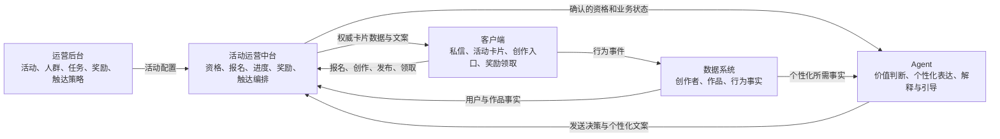

# 创作者活动运营链路与 Agent 边界

## 完整业务链路

创作者活动不是单个 Agent 可以独立完成的能力，而是多个平台共同维护的一条状态链路：

活动中台应当是业务状态的编排者，Agent 是受约束的决策和表达组件。Agent 不应成为另一个任务系统或奖励账本。

## 各平台的权威事实

| 事实 | 权威来源 | Agent 可以做什么 | Agent 不可以做什么 |
| --- | --- | --- | --- |
| 活动规则、目标人群、任务与奖励定义 | 运营后台，经活动中台发布 | 解释已发布规则 | 自创活动、规则或奖励 |
| 用户是否符合活动资格 | 活动运营中台 | 复述确认结果，结合创作方向解释原因 | 仅凭标签或作品数据确认资格 |
| 报名、任务进度、奖励状态 | 活动运营中台 | 解释当前状态和下一步 | 自行计数、推算完成、发奖或代领 |
| 创作者画像、作品表现、行为事件 | 数据系统 | 个性化推荐和作品诊断 | 修改数据或把相关性说成因果 |
| 活动卡片、按钮和页面状态 | 活动中台与客户端 | 生成配套文案、选择允许的表达模板 | 编造卡片字段或声称页面已更新 |
| 私信是否值得发送 | 活动中台策略约束 + Agent 最终价值判断 | 在频控和资格已确认后决定发送或跳过 | 绕过静默、去重、年龄和资格约束 |

运营知识库只说明活动规则，不是用户实时状态的来源。人群标签只表示候选范围，也不等同于活动资格。

## Agent 在活动邀请中的输入输出

目标形态下，活动中台调用 Agent 前应完成硬规则判断，并提供结构化上下文，至少包括：

- `campaignId`、活动状态和有效时间；
- `creatorId`、年龄路线和已确认的资格状态；
- 当前报名、任务进度和奖励状态；
- 触达频控、静默和去重结果；
- 官方活动入口或客户端 action；
- 允许向用户展示的任务与奖励摘要；
- 用于个性化的作品或行为事实引用。

Agent 返回的目标契约应包括：

- `SEND` 或 `NO_OUTREACH` 决策；
- 一条个性化文案；
- 内部原因码和使用的事实引用；
- 可选的卡片模板或 action 选择，但不包含自行生成的权威业务状态。

结构化活动卡片应由活动中台用权威字段组装。让模型直接生成奖励金额、任务进度、活动 ID 或领取状态，会引入不可审计的业务风险。

## 当前 MVP 的真实覆盖

| 模块 | 当前实现 | 结论 |
| --- | --- | --- |
| 运营后台 | 本地配置页面、活动知识文档、用户分层和定时任务 JSON | 仅用于配置与演示，不是正式运营平台 |
| 数据系统 | 六个只读作品数据工具，通过远程 MCP 调用 | 已具备稳定 Agent 边界，但尚无活动状态工具 |
| 活动运营中台 | 本地 scheduler、静默判断和 outbox | 只模拟触发与待发送消息，不具备资格、报名、进度或奖励能力 |
| Agent | `creator-chat` 与 `creator-outreach` 两个 Pi Agent Profile | 已负责作品诊断、推荐解释和触达价值判断 |
| 客户端 | 本地聊天页面与文本 outbox | 尚未接入真实 IM、活动卡片、创作入口或领奖动作 |

因此，当前 MVP 可以安全演示“根据作品事实生成建议”和“决定是否生成一条文本触达”，但不能宣称完成了完整活动闭环。

## 外部平台接入原则

- 通过活动中台提供的业务级 API 或 MCP 工具接入，不把通用 SQL、内部表结构或任意 HTTP 工具暴露给模型。
- 查询工具与变更工具分离。报名、领取奖励等写操作必须使用幂等键、明确鉴权、业务校验和审计日志。
- 确定性规则留在活动中台；Agent 只处理需要语义理解和个性化表达的部分。
- Agent 调用失败不应阻塞资格计算、任务记账或奖励发放；业务状态不能依赖模型输出落账。
- Langfuse 记录 Agent 决策和事实引用，活动中台记录业务操作，两侧通过 `campaignId`、`creatorId` 和 `runId` 关联。
