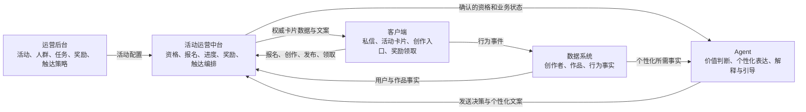

# 创作者活动运营链路与 Agent 边界

## 完整业务链路

创作者活动不是单个 Agent 可以独立完成的能力，而是多个平台共同维护的一条状态链路：



活动中台应当是业务状态的编排者，Agent 是受约束的决策和表达组件。Agent 不应成为另一个任务系统或奖励账本。

## 各平台的权威事实

| 事实 | 权威来源 | Agent 可以做什么 | Agent 不可以做什么 |
| --- | --- | --- | --- |
| 活动规则、目标人群、任务与奖励定义 | 运营后台，经活动中台发布 | 解释已发布规则 | 自创活动、规则或奖励 |
| 用户是否符合活动资格 | 活动运营中台 | 复述确认结果，结合创作方向解释原因 | 仅凭标签或作品数据确认资格 |
| 报名、任务进度、奖励状态 | 活动运营中台 | 解释当前状态和下一步 | 自行计数、推算完成、发奖或代领 |
| 创作者画像、作品表现、行为事件 | 数据系统 | 个性化推荐和作品诊断 | 修改数据或把相关性说成因果 |
| 活动卡片、按钮和页面状态 | 活动中台与客户端 | 生成配套文案、选择允许的表达模板 | 编造卡片字段或声称页面已更新 |
| 私信是否值得发送 | 活动中台策略约束 + Agent 最终价值判断 | 在频控和资格已确认后决定发送或跳过 | 绕过静默、去重、年龄和资格约束 |

运营知识库只说明活动规则，不是用户实时状态的来源。人群标签只表示候选范围，也不等同于活动资格。

## Agent 在活动邀请中的输入输出

目标形态下，活动中台调用 Agent 前应完成硬规则判断，并提供结构化上下文，至少包括：

- `campaignId`、活动状态和有效时间；
- `creatorId`、年龄路线和已确认的资格状态；
- 当前报名、任务进度和奖励状态；
- 触达频控、静默和去重结果；
- 官方活动入口或客户端 action；
- 允许向用户展示的任务与奖励摘要；
- 用于个性化的作品或行为事实引用。

Agent 返回的目标契约应包括：

- `SEND` 或 `NO_OUTREACH` 决策；
- 一条个性化文案；
- 内部原因码和使用的事实引用；
- 可选的卡片模板或 action 选择，但不包含自行生成的权威业务状态。

结构化活动卡片应由活动中台用权威字段组装。让模型直接生成奖励金额、任务进度、活动 ID 或领取状态，会引入不可审计的业务风险。

## 当前 MVP 的真实覆盖

| 模块 | 当前实现 | 结论 |
| --- | --- | --- |
| 运营后台 | 本地配置页面、活动知识文档、用户分层和定时任务 JSON | 仅用于配置与演示，不是正式运营平台 |
| 数据系统 | 六个只读作品数据工具，通过远程 MCP 调用 | 已具备稳定 Agent 边界，但尚无活动状态工具 |
| 活动运营中台 | 本地 scheduler、静默判断和 outbox | 只模拟触发与待发送消息，不具备资格、报名、进度或奖励能力 |
| Agent | `creator-chat` 与 `creator-outreach` 两个 Pi Agent Profile | 已负责作品诊断、推荐解释和触达价值判断 |
| 客户端 | 本地聊天页面与文本 outbox | 尚未接入真实 IM、活动卡片、创作入口或领奖动作 |

因此，当前 MVP 可以安全演示“根据作品事实生成建议”和“决定是否生成一条文本触达”，但不能宣称完成了完整活动闭环。

## 外部平台接入原则

- 通过活动中台提供的业务级 API 或 MCP 工具接入，不把通用 SQL、内部表结构或任意 HTTP 工具暴露给模型。
- 查询工具与变更工具分离。报名、领取奖励等写操作必须使用幂等键、明确鉴权、业务校验和审计日志。
- 确定性规则留在活动中台；Agent 只处理需要语义理解和个性化表达的部分。
- Agent 调用失败不应阻塞资格计算、任务记账或奖励发放；业务状态不能依赖模型输出落账。
- Langfuse 记录 Agent 决策和事实引用，活动中台记录业务操作，两侧通过 `campaignId`、`creatorId` 和 `runId` 关联。

## 最新 PRD 对齐（创作者运营 Agent MVP）

本节整理自最新版《创作者运营Agent PRD（ing）》。PRD 描述的是多个系统共同组成的企业级运营平台；本仓库只实现其中的 Agent 个性化层。文档中出现的其他系统、业务名词和产品能力，作为集成背景理解，不默认在本项目内实现。

### 产品目标

通过 IM 触达创作者，为创作者提供个性化活动邀请、作品数据反馈和创作建议。MVP 重点场景包括：

- 使用 Hashtag、Power 或 Template 完成创作并发布，获得积分或流量类权益；
- 根据创作者近期作品数据生成反馈、创作建议和个性化 Prompt；
- 运营输入 UID 调试一次活动或教程，预览用户实际收到的内容和 Agent 交互过程；
- 查询参与、完成、领取、失败等数据，并支持人工复核和补发。

### 平台分层

```text
运营后台
  → 活动运营中台：圈人、资格、进度、结算、触达编排
  → Agent 个性化层：推荐内容、解释数据、生成文案和 Prompt
  → 消息与卡片组装：固定事实 + 个性化内容
  → 客户端：私信、活动卡片、创作入口、进度和领奖
```

活动中台负责确定性规则；Agent 只能基于已确认的上下文进行个性化，不得自行生成权威业务状态。

### PRD 中的外部领域和术语

以下内容是本项目需要理解和正确调用的外部概念，不代表当前仓库要实现完整系统：

- `Creator Score`：由作品平均 VV、发布频次、收藏率、remix 率、点赞率、万 VV 作品率、评论率等指标加权计算的人群分层指数；
- `Power`、`Template`、`Hashtag`、`Prompt`：创作活动可推荐的外部创作资源；
- 活动、教程、反馈 MD：由运营配置或知识库提供的活动规则与内容背景；
- 积分、流量券、保量券、冷启券：外部权益系统管理的奖励和资源；
- DA/Data Skill、活动 Skill、教学 Skill、创作助手 Skill、产品背景 Skill、`USER_memory` Skill：Agent 能力模块或背景知识来源；
- 创作者中心、消息卡片、IM、行为埋点：客户端和消息平台能力；
- 数据系统、权益系统、任务系统、活动运营中台：应通过正式服务 API 或 MCP 提供能力。

### 当前仓库的实现边界

当前项目应聚焦以下能力：

- 使用 Profile 管理不同运营场景的模型、系统提示词、工具和运行策略；
- 通过 MCP 或业务级工具读取创作者作品与行为事实；
- 根据外部平台提供的活动事实、候选 Power/Template、资格结果和历史触达生成个性化内容；
- 输出可审计的 `SEND` / `NO_OUTREACH` 决策、文案、事实引用和可选卡片内容；
- 将可见文本、工具调用、模型用量和缓存命中情况写入观测系统。

当前项目不应在 Prompt 或本地 JSON 中实现以下能力：

- Creator Score 的正式计算和人群资格判定；
- 任务完成校验、活动进度记账、Level 变更和奖励发放；
- 真实 IM 投递、客户端卡片渲染和权益库存；
- 通用 SQL、任意后台写入或绕过频控的发送；
- 将 Power、Skill、Prompt 模板及完整背景知识重新手写一套。

### 企业开发中的常见边界

跨项目协作时，最容易出现的是把演示能力误认为平台能力，或让 Agent 越权承担业务状态。应坚持以下原则：

- 权威事实只能来自对应领域服务，Agent 输出不能覆盖后台状态；
- 读工具与写工具分离，写操作必须具备鉴权、幂等、校验和审计；
- 运营配置、任务规则和奖励目录需要版本化，不能依赖 Prompt 隐式约定；
- 活动中台、数据系统、IM、权益系统和客户端分别演进，通过稳定契约集成；
- 失败时优先保证业务状态一致性，Agent 失败不应导致重复发奖或错误触达；
- 调试、灰度和正式发送使用不同环境及凭证，观测数据通过业务 ID 关联而不是复制全部上下文。

若后续对 Power、Skill、Prompt 模板、Carmack 运行时注入或背景知识的具体流程不确定，应先核对 Carmack 项目的当前实现，再决定本项目是否需要适配。

### 远程业务 Skill 运行策略

业务 Skill 借鉴 Carmack 的动态注入链路，但本项目不把本地 `skills/` 目录作为事实来源：

1. Profile 只声明不可变的 `skill id + semver`；
2. 会话创建时从 S3 读取 Manifest 和版本包；
3. 校验包大小、SHA-256 和 `SKILL.md` 后，才物料化到当前会话的 `.pi/skills/`；
4. Pi 通过只读 `read` 读取 Skill，缓存按 `id/version/sha256` 隔离；
5. 远程包不可用时明确失败，不回退到仓库旧文件。

Skill 只承载稳定的运营规则和生成规范；创作者数据、资格、进度、奖励和 IM 动作仍由外部服务通过 MCP 提供。
