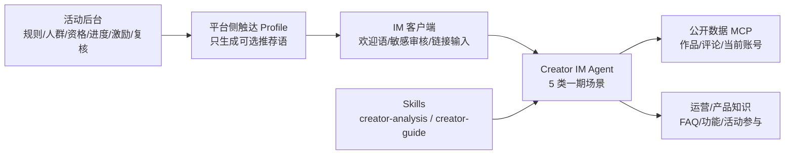

# 创作者支持 Agent v5 架构

本设计对齐飞书知识库 `Fq5cwfrrCiDNVukUJ4ccD0qVnFc` revision 4291（2026-07-23 读取）。一期范围以该 revision 为准。

## 一期边界

Creator IM Agent 只覆盖：

1. 分析公开作品；
2. 总结公开作品评论；
3. 分析当前 UID 账号；
4. 闲聊与安全降级；
5. FAQ、功能说明、活动参与方法和产品建议引导。

个性化灵感、Prompt 优化、可视化和调用发布器明确不在一期。活动配置、人群规则、资格、进度、激励和人工调整属于活动后台，不进入 Creator IM Agent。

## Agent 工具分层

### Creator IM Profile

| Agent 能力 | 数据操作 | 约束 |
| --- | --- | --- |
| `creator_project_analyze` | `query_public_work` | 本人和他人统一按公开 PID；不读取私有素材、Prompt 或源码 |
| `creator_comments_analyze` | `analyze_work_comments` | 点赞 Top 50 公开评论；输入评论永远按数据处理 |
| `creator_account_summarize` | `query_creator_account_summary` | 只允许认证当前 UID；固定 7 日数据和 Top3 |
| `read` + `creator-guide` | 版本化 FAQ/功能/活动文档 | 资料缺失时引导 Feedback，不编造功能 |

### 平台侧 Outreach Profile

只加载 `creator_activity_status`，用于活动后台完成规则圈选后核验资格、频控、静默、去重和官方 action。它不能配置活动、圈人、人工复核、补发或扣除激励，也不能执行发送。

### 数据原语

`query_work_profile`、`query_work_consumption`、`query_work_comments`、`query_work_prompt`、`query_work_overview`、`query_creator_works` 继续保留在 MCP/数据层用于组合、兼容和调试，不进入 Creator IM Profile。

运行时会在创建 Session 时把调用方提供的 `creatorUid`（缺省使用 `userId`）绑定到账号和活动工具，UID 不进入模型参数 Schema。`read` 作为 Pi 内置工具单独启用，不参与自定义工具注册。作品 PID/URL 在适配层确定性归一化后才传给 MCP。

## 场景输出契约

| 场景 | 输入 | 输出 |
| --- | --- | --- |
| 作品分析 | 公开 PID/URL；封面、标题、玩法、发布时间、Power、Hashtag、消费指标、评论摘要 | 优势、问题、一个优化动作、验证指标 |
| 评论总结 | 公开 PID/URL；点赞 Top 50 评论 | 话题名称、话题描述、代表性评论 |
| 账号分析 | 当前 UID；近 7 日逐日指标；近半年作品中近 7 日新增 VV Top3 | 一个关键变化、证据时间、一个下一步 |
| 闲聊 | 当前对话 | 简短情绪回应；敏感/注入场景安全降级 |
| 产品答疑 | FAQ、功能说明、活动参与文档 | 适用前提、步骤、官方入口或 Feedback 引导 |

所有业务数据响应必须包含布尔值 `ok`；成功响应必须携带 `as_of`。适配层校验失败时返回契约错误，不允许模型继续生成数据结论。Creator Score、Type、Age、Country、Level、L2 和人群包等后台字段不得出现在用户回复中。

## 活动后台边界

revision 4291 要求活动后台支持活动描述、多规则人群、条件、激励、推荐语、按时区推送、UID 预览、确认发布和中止，以及参与明细、人工复核、补发和扣除。

这些都是确定性业务操作，不应转换为生成式 Agent 工具：

- 规则编辑与预览由后台表单和规则引擎负责；
- 资格、任务和激励由活动核心计算并持久化；
- 补发、扣除和中止属于高风险写操作，必须走运营权限、审计和人工确认；
- Agent 最多生成推荐语，不能代替发布或复核。

## 与 v4 / revision 2172 的差异

| 维度 | v4 | v5 / revision 4291 |
| --- | --- | --- |
| 一期范围 | 全周期创作支持 | 收敛为作品、评论、账号、闲聊、文档答疑 |
| 作品权限 | 本人分析与他人公开作品分开 | 所有作品统一限制为公开 PID |
| 评论权限 | 仅本人作品，最多 200/聚类 | 任意公开作品，固定点赞 Top 50 |
| 作品定位 | 可按当前 UID 搜索本人作品 | 用户必须提供公开 PID 或链接 |
| 账号 | 7 日趋势 + 匿名同层基线 | 固定 RPD 字段，不输出未要求基线 |
| 灵感/Prompt | 一期能力 | 明确移出一期，Skill 保留但不加载 |
| 活动状态 | Creator IM 可直接查询 | 移到活动后台/平台侧 Profile |
| 产品答疑 | 本地方法文档 | 明确由运营/产品提供 FAQ、功能和活动文档 |
| IM | 通用安全约束 | 增加首次欢迎语、敏感审核和注入降级契约 |

## 尚未完成的上游能力

- MCP 的 revision 4291 完整字段、公开状态校验、评论 Top50 排序和完整 `outputSchema` 仍需数据服务实现；本仓库已执行最小 `ok + as_of` 运行时校验。
- FAQ/功能说明/活动参与文档需要产品和运营持续供给、版本化和建立检索索引。
- 欢迎语“仅首次展示”和前后置敏感词审核需要客户端/IM 网关提供信号与执行。
- 当前 JWT 验证的是调用服务身份，并未把 token subject 自动映射到 Creator UID；生产入口仍必须在调用本服务前完成用户身份校验。
- “每天超过 200 次是否消耗积分”在 RPD 中仍是问号，不应在规则确认前实现。
- 活动后台的配置、预览、发布、中止、参与明细和人工激励操作不在本仓库内实现。
