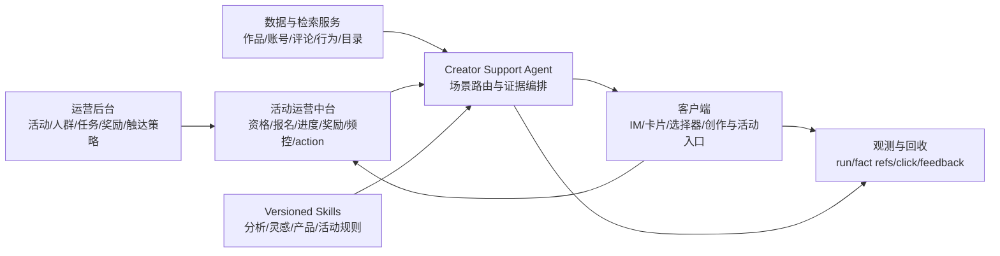

# 创作者支持 Agent v3 架构

本设计对齐飞书知识库 `Fq5cwfrrCiDNVukUJ4ccD0qVnFc` revision 2804（2026-07-22 读取）。飞书中的 readonly 架构图不可读取，因此本文只把可见需求、场景表、Platform 描述、角色 Todo 与创作分公式转成可执行边界，不把不可见内容视为已确认事实。

## 目标与边界

Agent 覆盖创作前、创作后和通用支持，但不替代数据系统、活动运营中台、客户端或运营后台。



确定性业务状态留在上游。Agent 只读取当前 UID 所需事实、解释证据、给出一个优先建议并选择官方下一步。Creator Score、Type、Path、Level、Age、Barrier、L2 等内部标签不得出现在创作者回复中。

## 场景路由

| 一级场景 | 二级场景 | 权威输入 | Agent 产出 | 客户端形态 |
| --- | --- | --- | --- | --- |
| 创作后 | 分析自己的作品 | 归属校验、发布后 14 天指标、五维分析、同类匿名基线、`as_of` | 结论、1-3 条证据、一个修改建议、验证指标 | 作品选择器、分析卡、雷达图 |
| 创作后 | 评论总结 | 本人作品评论、3-7 个聚类话题、代表性评论 ID | 话题摘要与可执行优化 | 评论话题卡 |
| 创作后 | 分析他人作品 | 公开字段、Power、Hashtag、公开表现 | 可迁移做法，不泄露私有素材/Prompt/源码 | 公开作品卡 |
| 创作后 | 账号总览 | 近 7 日逐日指标、匿名同层基线、近半年作品的新增 VV Top3 | 一个关键变化和一个下一步 | 指标卡、趋势图、Top3 |
| 创作前 | 活动/任务推送 | 有效活动、已确认资格、任务/奖励状态、频控、静默、去重、官方 action | `SEND` 或 `NO_OUTREACH` 与个性化文案 | 活动/任务/奖励卡 |
| 创作前 | 创作灵感 | 最近 10 条创作、最近 10 条互动、活动/作品/Power/Template/Hashtag 目录 | 0-1 个可参加活动、3-5 个多样化资源、首选切入点 | 灵感卡、创作入口 |
| 创作前 | 辅助创作 | 用户意图、产品能力与约束 | 可复制 Prompt、关键取舍、验收点 | 复制 Prompt、进入创作 |
| 通用 | 产品/功能/活动答疑 | 版本化产品和活动知识、活动当前状态 | 规则解释、操作步骤、官方入口 | 功能卡 |
| 通用 | 闲聊/抱怨/建议 | 当前会话、反馈入口状态 | 简短回应、问题摘要、提交引导 | 反馈卡 |

## 运行时分层

```text
HTTP / Scheduler
  -> Agent Profile (creator-chat / creator-outreach)
  -> Scenario Router (system prompt)
  -> Scenario Skill
       creator-analysis
       creator-inspiration
       creator-guide
       ops-activities
  -> Read-only business tools
  -> Loopit Data MCP / Activity Core
  -> Evidence-bound response
  -> IM text + upstream-owned card/action
```

- Profile 固定模型、轮次、Skill 与工具白名单。
- Skill 保存稳定工作流和边界，不保存当前资格、任务进度或奖励状态。
- MCP 工具返回结构化事实、口径和 `as_of`；模型不接触通用 SQL。
- 卡片中的 ID、任务、奖励、进度、按钮和状态由上游组装，Agent 只生成解释文案。
- Langfuse 记录 Profile、Prompt 版本、工具调用与事实引用；活动中台用 `campaignId + creatorId + runId` 关联业务操作。

## MCP 契约

| 工具 | 用途 | 关键约束 |
| --- | --- | --- |
| `query_creator_works` | 本人作品候选与消歧 | 按 UID 查询 |
| `query_work_analysis` | 本人作品五维分析 | `uid + pid` 校验归属；窗口最多 14 天 |
| `analyze_work_comments` | 评论聚类 | 仅本人作品；3-7 话题与代表性 ID |
| `query_public_work` | 学习他人作品 | 只返回公开字段 |
| `query_creator_account_summary` | 账号近 7 日总览 | 内部 Level 只用于匿名基线 |
| `query_creator_inspiration_context` | 最近创作与互动信号 | 最小必要摘要，不返回内部画像 |
| `search_creation_catalog` | 搜活动/作品/Power/Template/Hashtag | 搜索结果不代表活动资格 |
| `query_creator_activity_status` | 资格、任务、奖励、触达约束与 action | 活动状态唯一权威只读入口 |

保留原有作品画像、消费、评论、Prompt 与 overview 工具，兼容既有作品诊断调用。
MCP 在连接时发现服务端能力，调用时再检查具体工具；因此新增契约可以逐项上线，不会因为某个新工具尚未部署而阻断原有作品查询。

## 响应与降级

所有个性化回答遵循“结论 → 证据与数据时间 → 一个优先建议 → 一个下一步”。

| 异常 | 行为 |
| --- | --- |
| 多个作品候选 | 展示候选，只让用户选择一次 |
| VV <= 100、窗口未成熟 | 说明证据不足，不输出确定性表现判断 |
| 数据服务失败 | 不用旧会话数据伪装当前事实；说明暂时不可查 |
| 活动资格/action 缺失 | 不发活动邀请，不生成权威卡片字段 |
| 知识版本不明 | 标注未确认，以当前产品或活动页为准 |
| 内部状态冲突 | 不拼接结论，指出对应权威系统尚未同步 |

## 与 origin/main 的差异

| 维度 | origin/main | v3 重写 |
| --- | --- | --- |
| 产品定位 | 作品诊断 + 文本触达 MVP | 创作前/后/通用的完整创作者支持入口 |
| 场景 | 作品列表、画像、消费、评论、Prompt | 增加本人五维分析、账号总览、评论聚类、公开作品学习、灵感检索、活动任务状态 |
| Skill | `creator-guide`、`ops-activities` | 新增 `creator-analysis`、`creator-inspiration`，原 Skill 收窄职责 |
| 数据契约 | 6 个作品只读工具 | 兼容原 6 个并新增 7 个业务工具 |
| 活动状态 | Prompt 中声明外部负责，但无查询工具 | `query_creator_activity_status` 成为资格/进度/奖励/action 的权威入口 |
| 内部标签 | 有边界说明 | 明确所有创作者回复禁止暴露 Creator Score/Level/L2 等标签 |
| 输出 | 作品建议或 80 字触达文本 | 统一证据时间、一个优先建议、下一步与卡片权威字段分离 |
| 主动触达 | 本地 scheduler + `NO_OUTREACH` | 增加活动有效性、资格、年龄路线、action、频控/静默/去重的完整发送门槛 |

## 当前实现状态

本分支实现 Profile、Prompt、Skill 和 MCP 客户端契约，并保留现有 HTTP、会话、调度、outbox 与观测链路。新增业务工具需要 Loopit Data MCP 和活动运营中台按契约提供真实实现；在此之前，本仓库不能宣称已具备线上资格判断、真实任务进度、发奖或卡片发送能力。
